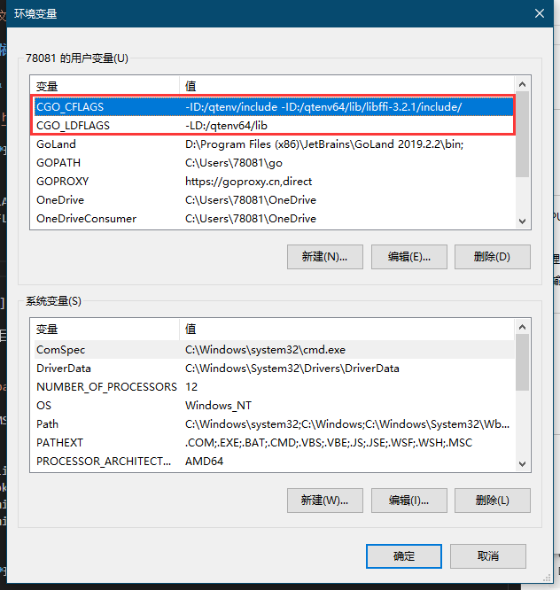

# Windows 安装 qt.go

> 参考自官方[文档](https://github.com/kitech/qt.go)。

## 安装依赖

**libffi && dlfcn && Qt5Inline.dll**

```shell
git clone https://github.com/qtchina/qt512_qtenv_win64.git D:/qtenv64
```

**配置用户环境变量**

```shell
set CGO_CFLAGS=-ID:/qtenv64/include -ID:/qtenv/lib/libffi-3.2.1/include/
set CGO_LDFLAGS=-LD:/qtenv64/lib
```



**配置系统环境变量 ( Path )**

```shell
D:\qtenv64\bin
```

## MSSYS

安装 [MSYS2](http://www.msys2.org/) 后替换源 ( 打开 _C:\msys64\etc\pacman.d_ 分别将 3 个 **源文件的内容** 替换为对应的 **[源文件内容](https://mirrors.tuna.tsinghua.edu.cn/help/msys2/)** ) 。

重新打开 MSYS2 ( 路径为根目录下的 _msys2_shell_ ，也可以从开始菜单打开 **MSYS2 MSYS** ) 更新软件包：`pacman -Syuu` ( **重复执行此命令直到提示没有任何更新** ) 。

如出现如下提示，关闭窗口，重新打开执行：`pacman -Syuu`

```shell
警告：terminate MSYS2 without returning to shell and check for updates again
警告：for example close your terminal window instead of calling exit
```

**安装 mingw-w64**

```shell
pacman -S mingw-w64-x86_64-toolchain
```

**配置系统环境变量 ( Path )**

```shell
C:\msys64\mingw64\bin
C:\msys64\usr\bin
```

## 编译 qt.go

```shell
go get github.com/kitech/dl
# 如果提示找不到路径，实际已经安装成功。
go get github.com/kitech/qt.go

cd %GOPATH%/src/github.com/kitech/qt.go/examples

go build -o button.exe button.go
```
